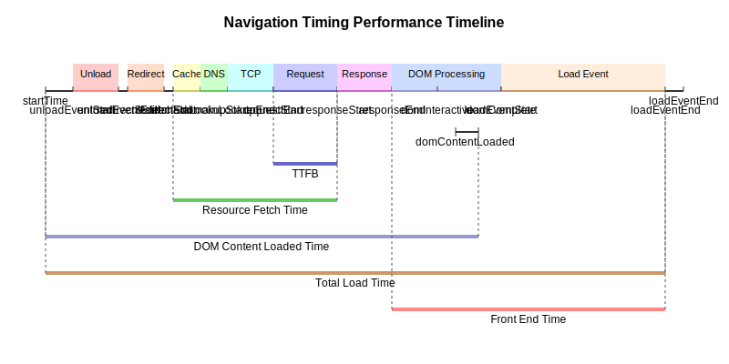

# 导航计时指标 (Navigation Timing)

## 概述

导航计时 (Navigation Timing) 提供了网页加载过程中各个阶段的精确时间测量，从页面卸载到完全加载的整个流程。这些指标可以帮助开发者识别性能瓶颈，优化用户体验。

## 指标收集方式

本库通过 `window.addEventListener('load')` 事件在页面完全加载后收集导航计时数据，使用 Performance API 的 `getEntriesByType('navigation')` 方法获取详细的导航时间指标。导航计时数据只会在每次页面加载时收集一次。

## 关键指标详解

以下是收集的主要导航计时指标，按照页面加载流程的时间顺序排列：

### 导航阶段

| 指标名称 | 描述 | 计算方式 |
|---------|------|---------|
| `unloadTime` | 卸载前一个页面所花费的时间 | `unloadEventEnd - unloadEventStart` |
| `redirectTime` | 页面重定向所花费的时间 | `redirectEnd - redirectStart` |
| `appCacheTime` | 应用缓存检查时间 | `domainLookupStart - fetchStart` |

### 连接与请求阶段

| 指标名称 | 描述 | 计算方式 |
|---------|------|---------|
| `serviceWorkerTime` | Service Worker 启动时间 | `workerStart - fetchStart` (仅当 workerStart > 0) |
| `dnsTime` | DNS 解析时间 | `domainLookupEnd - domainLookupStart` |
| `tcpTime` | TCP 连接建立时间 | `connectEnd - connectStart` |
| `sslTime` | SSL/TLS 握手时间 | `connectEnd - secureConnectionStart` (仅当 secureConnectionStart > 0) |
| `requestTime` | 请求发送时间 | `responseStart - requestStart` |
| `ttfb` | 首字节时间 (Time To First Byte) | `responseStart - requestStart` |
| `resourceFetchTime` | 资源获取总时间 | `responseStart - fetchStart` |
| `responseTime` | 响应接收时间 | `responseEnd - responseStart` |

### 渲染与处理阶段

| 指标名称 | 描述 | 计算方式 |
|---------|------|---------|
| `initDOMTime` | DOM 初始化时间 | `domInteractive - responseEnd` |
| `processingTime` | DOM 处理时间 | `domComplete - domInteractive` |
| `contentLoadTime` | DOM 内容加载事件处理时间 | `domContentLoadedEventEnd - domContentLoadedEventStart` |
| `domContentLoaded` | DOM 内容加载完成时间 (从导航开始) | `domContentLoadedEventEnd - startTime` |
| `loadEventDuration` | load 事件处理时间 | `loadEventEnd - loadEventStart` |
| `frontEndTime` | 前端总渲染时间 | `loadEventEnd - responseEnd` |
| `totalLoadTime` | 总加载时间 | `loadEventEnd - startTime` |

## 指标解读与优化建议

### TTFB (Time to First Byte)
- **良好**: < 200ms
- **需要改进**: 200-500ms
- **较差**: > 500ms
- **优化建议**: 优化服务器响应时间、使用CDN、考虑边缘计算

### 总加载时间 (Total Load Time)
- **良好**: < 2.5s
- **需要改进**: 2.5-4s
- **较差**: > 4s
- **优化建议**: 减少资源大小、启用压缩、优化关键渲染路径

### DNS 解析时间
- **良好**: < 20ms
- **需要改进**: 20-100ms
- **较差**: > 100ms
- **优化建议**: 使用 DNS 预取、切换 DNS 服务提供商

### 前端渲染时间 (Front End Time)
- **良好**: < 1s
- **需要改进**: 1-2s
- **较差**: > 2s
- **优化建议**: 减少 JavaScript 执行时间、优化 CSS、减少渲染阻塞资源

## 使用示例

```javascript
import { NavigationTimingObserver } from 'perf-observer-kit';

// 创建导航计时观察者实例
const navigationObserver = new NavigationTimingObserver({
  enabled: true,
  includeRawTiming: true,
  onUpdate: (metrics) => {
    console.log('Navigation Timing Metrics:', metrics);
    
    // 示例: 记录 TTFB 和总加载时间
    console.log(`TTFB: ${metrics.ttfb}ms`);
    console.log(`Total Load Time: ${metrics.totalLoadTime}ms`);
  }
});

// 开始监控
navigationObserver.start();
```

## Performance Timeline 可视化



上图展示了导航计时的各个阶段在时间轴上的分布，帮助理解不同指标之间的关系和整个页面加载过程。 